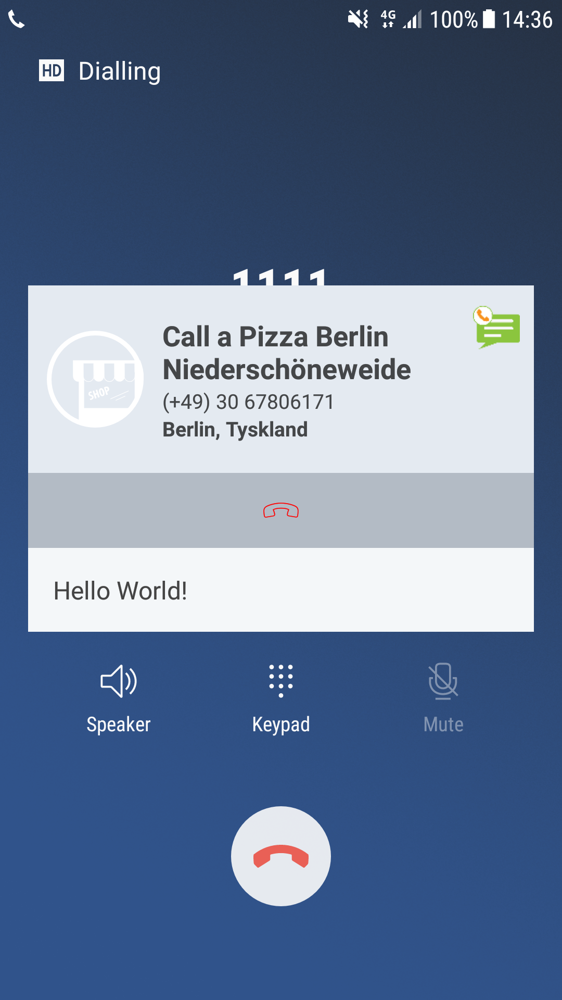
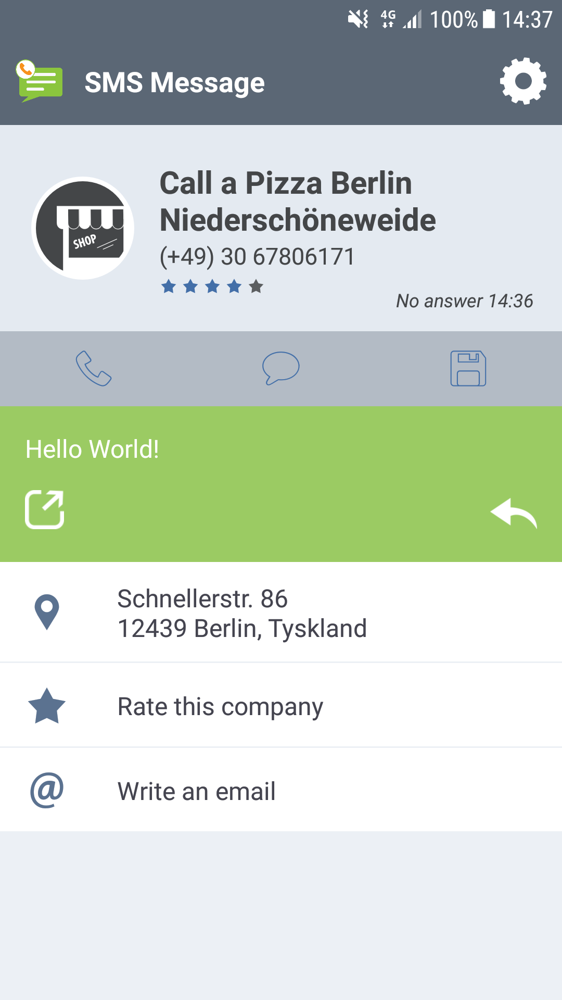

# Message Template

Code sample for a messaging app.

## Get Started

### Step 1
Declare a new receiver in the manifest.
  
 ```
<receiver
    android:name=".receiver.CustomViewReceiver"
    android:enabled="true">
    <intent-filter android:priority="101">
        <action android:name="com.calldorado.android.intent.SEARCH" />
        <action android:name="android.intent.action.PHONE_STATE" />
    </intent-filter>
</receiver>
```

### Step 2
Your receiver is where you set your views so that Calldorado can access them on runtime. You can provide up to three different views to be used in different places.

```
public class CustomViewReceiver extends BroadcastReceiver {

    @Override
    public void onReceive(Context context, Intent intent) {

        if (intent.getAction().equals("com.calldorado.android.intent.SEARCH") ||
                intent.getAction().equals("android.intent.action.PHONE_STATE")) {

	    Calldorado.setAftercallCustomView(
		    new AftercallCustomView(context));
					   
	    Calldorado.setWicDisplayCustomView(
		    new WicDisplayCustomView(context));					   

        }
    }
}
```

### Step 3
Create a class that extends from CalldoradoCustomView and overrides the method getRootView(), from where you can inflate a layout resource or create the UI programmatically. Open the classes AftercallCustomView.java or WicDisplayCustomView.java for samples.

## Images

See how the template looks like.

|  WIC (lastest message)|  Aftercall (lastest message)  | Aftercall (write message)  |
|---|---|---|
|    |    |    |
 
